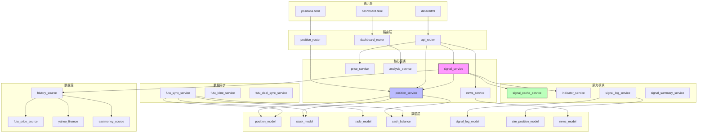
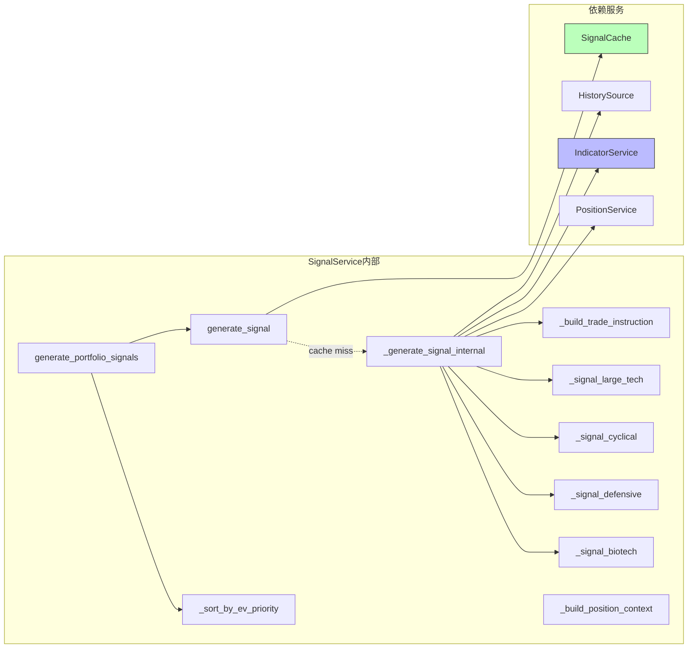
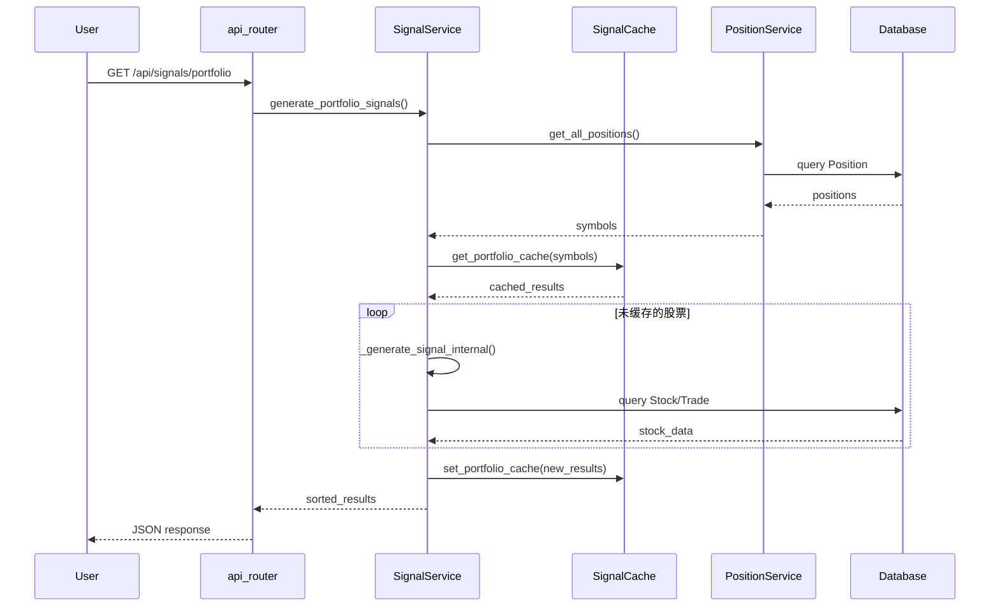
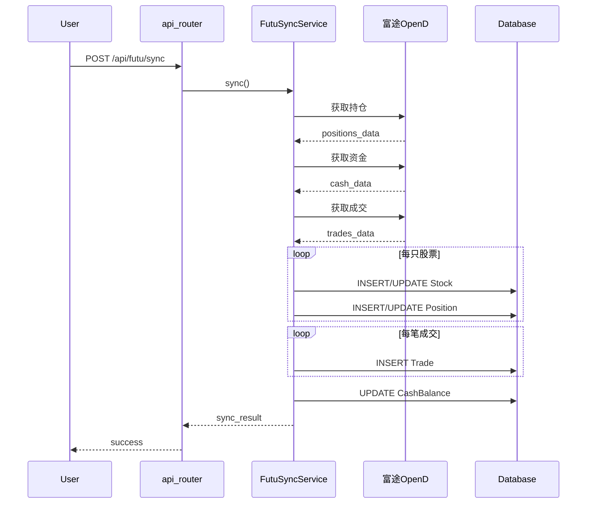
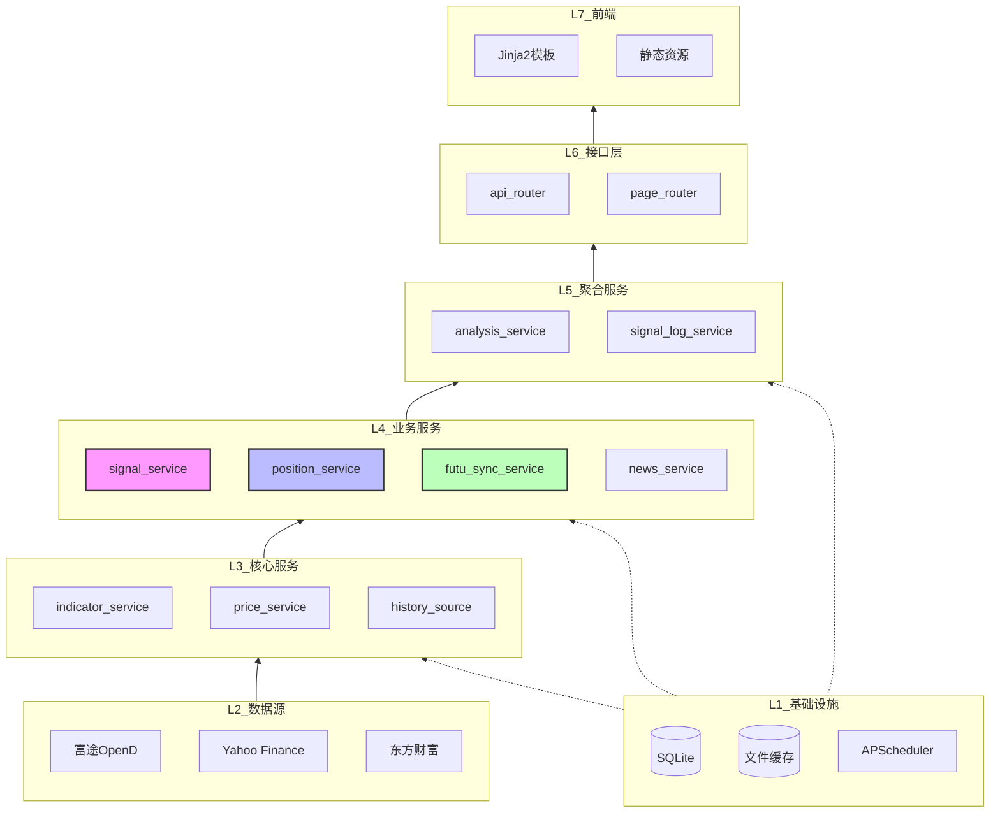
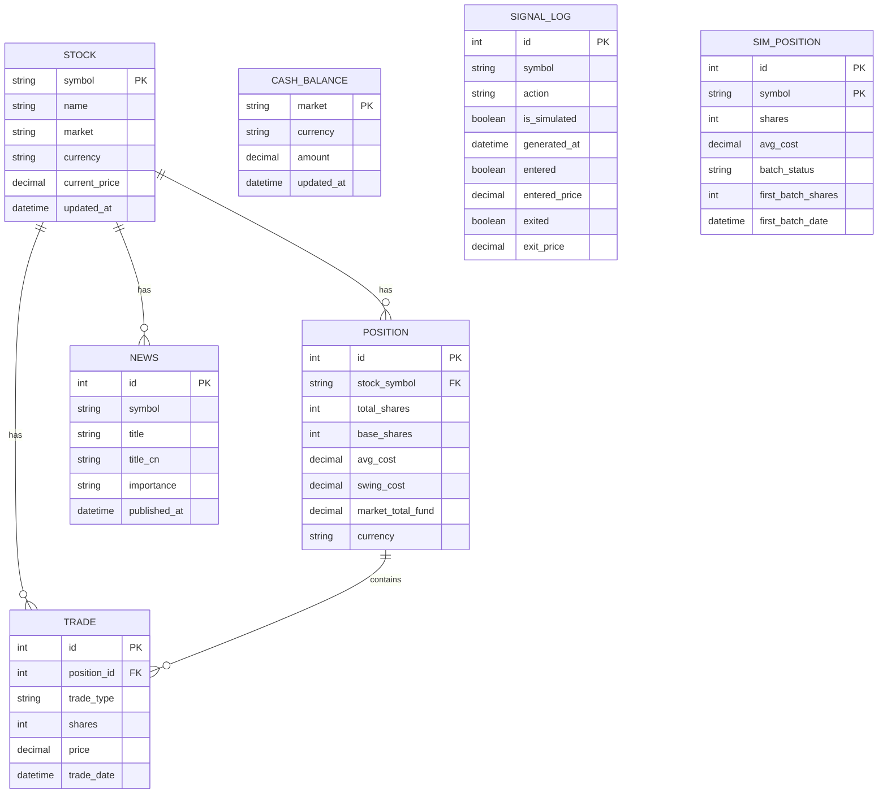

# 光剑系统架构分解

> 文档版本: v1.0
> 生成日期: 2026-03-25
> 对应系统版本: v1.4.0

---

## 一、系统概览

光剑系统是一个基于 **FastAPI + SQLAlchemy + Jinja2** 的持仓管理与交易信号系统，支持港股/美股/A股的实盘与模拟交易对比分析。

### 1.1 核心特性

| 特性 | 说明 |
|------|------|
| **多市场支持** | 港股(HK)、美股(US)、A股(A) |
| **原力信号** | 4类股票策略，ATR动态止损，EV优先级排序 |
| **模拟交易** | 自动跟单，分批建仓，实盘对比 |
| **演示模式** | Cookie持久化， fixture数据，无需实盘 |
| **信号缓存** | 批量缓存，热缓存85ms响应 |

---

## 二、分层架构

```
┌─────────────────────────────────────────────────────────────────┐
│                        表示层 (Presentation)                     │
│  ┌─────────────┐  ┌─────────────┐  ┌─────────────────────────┐  │
│  │ positions   │  │  dashboard  │  │    detail (个股详情)     │  │
│  │   (持仓页)   │  │  (体检报告)  │  │    K线/对比/统计        │  │
│  └─────────────┘  └─────────────┘  └─────────────────────────┘  │
├─────────────────────────────────────────────────────────────────┤
│                         路由层 (Router)                          │
│  ┌──────────────┐ ┌──────────────┐ ┌──────────────────────────┐ │
│  │position_router│ │dashboard_router│ │      api_router         │ │
│  │   页面路由     │ │   体检报告路由  │ │   API端点 (RESTful)      │ │
│  └──────────────┘ └──────────────┘ └──────────────────────────┘ │
├─────────────────────────────────────────────────────────────────┤
│                        服务层 (Service)                          │
│  ┌────────────┐ ┌────────────┐ ┌────────────┐ ┌──────────────┐  │
│  │   核心服务  │ │   数据同步  │ │   分析服务  │ │   新闻服务    │  │
│  │ signal_svc │ │ futu_sync  │ │ indicator  │ │ news_svc     │  │
│  │ position   │ │ kline_svc  │ │ analysis   │ │ news_process │  │
│  │ price_svc  │ │ deal_sync  │ │ backtest   │ │              │  │
│  └────────────┘ └────────────┘ └────────────┘ └──────────────┘  │
│  ┌────────────┐ ┌────────────┐ ┌────────────┐ ┌──────────────┐  │
│  │   原力模块  │ │   信号缓存  │ │   模拟交易  │ │   演示服务    │  │
│  │ signal_svc │ │ signal_cache│ │ signal_log │ │ demo_service │  │
│  │ cache_svc  │ │            │ │ sim_position│ │              │  │
│  │ summary_svc│ │            │ │ timeline   │ │              │  │
│  └────────────┘ └────────────┘ └────────────┘ └──────────────┘  │
├─────────────────────────────────────────────────────────────────┤
│                      数据源层 (Data Source)                       │
│  ┌────────────┐ ┌────────────┐ ┌────────────┐ ┌──────────────┐  │
│  │  富途OpenD  │ │   Yahoo    │ │   东方财富  │ │    其他数据源  │  │
│  │ futu_price │ │ yahoo_fin  │ │ eastmoney  │ │ tushare      │  │
│  │ futu_kline │ │ yahoo_src  │ │            │ │ alpha_vantage│  │
│  │            │ │            │ │            │ │ exchange_rate│  │
│  └────────────┘ └────────────┘ └────────────┘ └──────────────┘  │
│  ┌────────────┐ ┌────────────┐                                   │
│  │  历史数据   │ │   聚合层    │                                   │
│  │ history_src│ │aggregated  │                                   │
│  └────────────┘ └────────────┘                                   │
├─────────────────────────────────────────────────────────────────┤
│                        数据层 (Data)                             │
│  ┌────────────┐ ┌────────────┐ ┌────────────┐ ┌──────────────┐  │
│  │   Position │ │    Stock   │ │    Trade   │ │   CashBalance│  │
│  │   (持仓)    │ │   (股票)    │ │   (交易)    │ │   (现金余额)  │  │
│  └────────────┘ └────────────┘ └────────────┘ └──────────────┘  │
│  ┌────────────┐ ┌────────────┐ ┌────────────┐ ┌──────────────┐  │
│  │  SimPosition│ │  SignalLog │ │    News    │ │   Config     │  │
│  │  (模拟持仓) │ │  (信号日志) │ │   (新闻)    │ │  (配置)       │  │
│  └────────────┘ └────────────┘ └────────────┘ └──────────────┘  │
│                    SQLite + SQLAlchemy ORM                       │
├─────────────────────────────────────────────────────────────────┤
│                      计划任务层 (Scheduler)                       │
│              APScheduler - 定时拉取新闻、价格更新                  │
└─────────────────────────────────────────────────────────────────┘
```

---

## 三、模块详细展开

### 3.1 原力模块 (信号系统)

**文件位置**: `app/services/signal_service.py` (500+ 行)

**核心职责**:
- 4类股票信号策略生成
- ATR动态止损计算
- 多模型仓位计算 (Kelly/FIXED_RISK/VOLATILITY_ADJUSTED)
- EV优先级排序
- 批量缓存优化

**类设计**:

```python
class SignalService:
    - __init__(db: Session)
    - generate_signal(symbol, use_cache=True) -> SignalResult
    - generate_portfolio_signals(use_cache=True) -> list[SignalResult]
    - _generate_signal_internal(symbol) -> SignalResult  # 核心逻辑
    - _signal_large_tech(df, snap) -> (action, confidence, triggers, conflicts)
    - _signal_cyclical(df, snap) -> (action, confidence, triggers, conflicts)
    - _signal_defensive(df, snap) -> (action, confidence, triggers, conflicts)
    - _signal_biotech(df, snap) -> (action, confidence, triggers, conflicts)
    - _build_trade_instruction(...) -> TradeInstruction
    - _sort_by_ev_priority(results) -> list[SignalResult]

@dataclass
class SignalResult:
    symbol: str
    action: str              # BUY/SELL/WATCH/HOLD
    confidence: str          # HIGH/MEDIUM/LOW
    triggers: list           # 触发条件
    conflicts: list          # 冲突条件
    indicators: dict         # 指标快照
    instruction: TradeInstruction  # 交易指令

@dataclass
class TradeInstruction:
    entry_condition: str
    sizing_model: str        # KELLY_HALF/FIXED_RISK/VOLATILITY_ADJUSTED
    stop_condition: str
    recommended_shares: int
    recommended_shares_second: int  # 分批建仓第二批
```

**股票分类配置**:

| 类别 | 代码示例 | 策略 | 核心指标 |
|------|----------|------|----------|
| large_tech | 腾讯、阿里、Meta | 趋势跟踪 | EMA金叉+MACD+ADX |
| cyclical | 吉利、特斯拉、SoFi | 均值回归 | RSI+布林带+MACD背离 |
| defensive | 联合健康、粤海投资 | 低波动 | 布林带+RSI |
| biotech | 百济、Rocket Lab | 极值交易 | RSI极值+ATR |

---

### 3.2 信号缓存模块

**文件位置**: `app/services/signal_cache_service.py` (240+ 行)

**核心职责**:
- 内存缓存 + 文件缓存双层架构
- 批量读写优化
- 时间敏感缓存策略

**类设计**:

```python
class SignalCache:
    - CACHE_DURATION_OPEN = 15      # 开盘中15分钟
    - CACHE_DURATION_CLOSED = 120   # 收盘后2小时
    - _memory_cache: Dict[str, (result, timestamp)]

    - get(symbol) -> Optional[SignalResult]           # 单条读取
    - set(symbol, result)                             # 单条写入
    - get_portfolio_cache(symbols) -> Dict[str, SignalResult]  # 批量读取
    - set_portfolio_cache(results)                    # 批量写入
    - clear(symbol=None)                              # 清除缓存
    - _is_market_open() -> bool                       # 判断开盘时间
```

**缓存策略**:

```
缓存键: {date}_{symbol}  (如: 20260325_HK:00700)
缓存文件: data/signal_cache/{date}_{symbol}.pkl

开盘中 (09:30-15:00): 缓存15分钟
收盘后 (15:00-次日09:30): 缓存2小时
周末: 视为收盘状态
```

---

### 3.3 持仓管理模块

**文件位置**: `app/services/position_service.py`, `app/models/position.py`

**核心职责**:
- 持仓CRUD操作
- 盈亏计算 (支持负成本)
- 市场分布分析
- 信号优先排序

**数据模型**:

```python
class Position(Base):
    id: int
    stock_symbol: str           # 关联股票
    total_shares: int           # 总股数
    base_shares: int            # 底仓股数
    base_cost: Decimal          # 底仓成本
    avg_cost: Decimal           # 加权平均成本 (可为负!)
    swing_cost: Decimal         # 波段仓成本
    trading_cost: Decimal       # 交易成本
    market_total_fund: Decimal  # 市场总资金
    currency: str               # HKD/USD/CNY

    # 关系
    stock: Stock
    trades: List[Trade]
```

**关键算法**:

```python
# 盈亏计算 (支持负成本)
if invested > 0:
    pnl_pct = pnl_amount / invested * 100
elif market_val > 0:
    pnl_pct = pnl_amount / market_val * 100  # 负成本用市值为分母

# 信号优先排序
positions.sort(key=lambda p: (
    signal_priority.get(p.signal_action, 99),  # BUY=0, SELL=1, WATCH=2, HOLD=3
    -(p.position_weight or 0)                   # 同信号按仓位降序
))
```

---

### 3.4 模拟交易模块

**文件位置**: `app/services/signal_log_service.py`, `app/models/sim_position.py`

**核心职责**:
- 信号日志记录与跟踪
- 模拟持仓自动跟单
- 分批建仓管理
- 实盘 vs 模拟对比

**数据模型**:

```python
class SignalLog(Base):
    id: int
    symbol: str
    action: str              # BUY/SELL
    is_simulated: bool       # 是否模拟
    generated_at: datetime
    entered: bool            # 是否已入场
    entered_at: datetime
    entered_price: float
    exited: bool             # 是否已出场
    exited_at: datetime
    exit_price: float
    actual_pct: float        # 实际盈亏%

class SimPosition(Base):
    id: int
    symbol: str
    shares: int
    avg_cost: float

    # 分批建仓字段
    batch_status: str        # IDLE/FIRST_DONE/SECOND_DONE
    first_batch_shares: int
    first_batch_price: float
    first_batch_date: datetime
    second_batch_pending: int
```

**分批建仓逻辑**:

```
第一批: 信号日执行 50% Kelly仓位
第二批触发条件 (满足其一):
  1. 价格回调 ≥ 3%
  2. 距离第一批 ≥ 3天
  3. 价格 ≥ 第一批价格
```

---

### 3.5 数据同步模块

**文件位置**: `app/services/futu_sync_service.py`, `app/data_sources/`

**核心职责**:
- 富途OpenD持仓同步
- K线数据拉取与缓存
- 历史成交同步

**数据源实现**:

| 数据源 | 文件 | 功能 | 优先级 |
|--------|------|------|--------|
| 富途OpenD | `futu_price_source.py` | 实时价格 | 1 |
| 富途OpenD | `futu_kline_service.py` | K线数据 | 1 |
| Yahoo | `yahoo_finance.py` | 美股价格 | 2 |
| 东方财富 | `eastmoney_source.py` | A股数据 | 2 |
| Tushare | `tushare_source.py` | A股备选 | 3 |
| Alpha Vantage | `alpha_vantage_source.py` | 汇率 | 备用 |

**富途同步流程**:

```python
FutuSyncService.sync():
  1. 连接 OpenD (127.0.0.1:11111)
  2. 获取持仓列表
  3. 获取账户资金
  4. 获取今日成交
  5. 更新 Stock 表 (基本信息)
  6. 更新 Position 表 (持仓)
  7. 更新 CashBalance 表 (现金)
  8. 插入 Trade 表 (成交记录)
```

---

### 3.6 技术指标模块

**文件位置**: `app/services/indicator_service.py`

**核心职责**:
- 纯 pandas 实现 (无需 ta-lib)
- 计算 EMA/MACD/RSI/ATR/布林带/ADX

**指标清单**:

| 指标 | 周期 | 用途 |
|------|------|------|
| EMA | 20, 60 | 趋势判断 |
| MACD | 12, 26, 9 | 动能判断 |
| RSI | 14 | 超买超卖 |
| ATR | 14 | 止损计算 |
| 布林带 | 20, 2 | 波动率/均值回归 |
| ADX | 14 | 趋势强度 |

---

### 3.7 新闻模块

**文件位置**: `app/services/news_service.py`, `app/data_sources/news_source.py`

**核心职责**:
- yfinance 新闻拉取
- LLM 翻译 + 重要度打分
- 定时任务调度

**处理流程**:

```
┌─────────────┐    ┌─────────────┐    ┌─────────────┐    ┌─────────────┐
│ yfinance    │───>│ news_service│───>│ news_process│───>│   数据库     │
│ 拉取新闻    │    │  初步过滤    │    │ LLM处理     │    │  News表     │
└─────────────┘    └─────────────┘    └─────────────┘    └─────────────┘
                                              │
                                              ▼
                                       ┌─────────────┐
                                       │ 翻译标题    │
                                       │ 重要度打分  │
                                       │ HIGH/MEDIUM/LOW
                                       └─────────────┘
```

**定时任务**:

```python
scheduler.add_job(
    fetch_hk_news,
    trigger=CronTrigger(hour=16, minute=15),  # 港股 16:15 HKT
    id="港股新闻定时拉取"
)
scheduler.add_job(
    fetch_us_news,
    trigger=CronTrigger(hour=5, minute=30),   # 美股 05:30 HKT
    id="美股新闻定时拉取"
)
```

---

### 3.8 分析服务模块

**文件位置**: `app/services/analysis_service.py`

**核心职责**:
- 持仓体检报告生成
- 健康度评分计算
- 行动计划生成

**8大分析模块**:

| 模块 | 功能 |
|------|------|
| 组合概览 | 健康度评分、总资产、现金占比、预期收益 |
| 持仓结构 | 市场分布、板块分布 |
| 风险警告 | 集中度风险、波段被套检测 |
| TOP5持仓 | 最大持仓明细、波段状态 |
| 行动计划 | P0立即/P1条件触发/P2监控 |
| 纪律检查 | 止损违规、加仓违规、集中度违规 |

**健康度评分算法**:

```python
score = 100
score -= cash_penalty(max(0, 30 - cash_pct))      # 现金不足扣分
score -= concentration_penalty(top5_concentration) # 集中度扣分
score -= negative_ev_penalty(negative_ev_positions) # 负EV扣分
score = max(0, min(100, score))
```

---

### 3.9 演示模式模块

**文件位置**: `app/services/demo_service.py`, `app/fixtures/demo_data.py`

**核心职责**:
- Cookie-based 模式切换
- Fixture 数据提供
- 演示状态检测

**实现机制**:

```python
# Cookie 设置
def set_demo_mode(response):
    response.set_cookie(COOKIE_NAME, "demo", max_age=365*24*60*60)

# 模式检测
def is_demo_mode(request) -> bool:
    return request.cookies.get(COOKIE_NAME) == "demo"

# 演示数据覆盖
if is_demo_mode(request):
    return get_demo_portfolio()  # 使用 fixture 数据
else:
    return get_real_portfolio()  # 使用真实数据
```

---

## 四、模块依赖关系图

### 4.1 整体依赖图



### 4.2 原力模块内部依赖



### 4.3 数据流向图



### 4.4 富途同步数据流



### 4.5 模块层级依赖图



---

## 五、数据库模型关系

### 5.1 ER 图



### 5.2 表关系说明

| 表 | 主键 | 外键 | 用途 |
|---|------|------|------|
| stocks | symbol | - | 股票基础信息 |
| positions | id | stock_symbol | 持仓记录 |
| trades | id | position_id | 交易流水 |
| cash_balances | market | - | 各市场现金 |
| signal_logs | id | - | 信号历史 |
| sim_positions | id | - | 模拟持仓 |
| news | id | - | 新闻数据 |

---

## 六、关键业务流程

### 6.1 信号生成流程

```
用户请求 /api/signals/portfolio
    │
    ▼
生成持仓列表 (PositionService.get_all_positions)
    │
    ▼
批量检查缓存 (SignalCache.get_portfolio_cache)
    │
    ├── 缓存命中 → 直接返回
    │
    └── 缓存未命中 ──> 生成信号 (逐个)
            │
            ├── 拉历史数据 (HistorySource)
            │
            ├── 计算指标 (IndicatorService.compute_all)
            │       └── EMA/MACD/RSI/ATR/布林带/ADX
            │
            ├── 分类信号逻辑
            │       ├── large_tech → EMA金叉策略
            │       ├── cyclical → RSI均值回归
            │       ├── defensive → 布林带策略
            │       └── biotech → RSI极值策略
            │
            ├── 市场环境检查 (指数EMA趋势)
            │
            ├── 仓位上下文分析
            │
            ├── 回测参数读取
            │
            ├── 构建交易指令 (分批建仓)
            │
            └── 返回 SignalResult
    │
    ▼
批量保存缓存 (SignalCache.set_portfolio_cache)
    │
    ▼
EV优先级排序
    │
    ▼
返回 JSON 响应
```

### 6.2 页面渲染流程

```
用户访问 /positions
    │
    ▼
position_router.get_positions()
    │
    ├── 检查演示模式 (demo_service.is_demo_mode)
    │       ├── demo → 返回 fixture 数据
    │       └── real → 查询数据库
    │
    ├── 获取持仓列表 (PositionService)
    │
    ├── 获取市场分布
    │
    └── 获取现金余额
    │
    ▼
渲染模板 positions.html
    │
    ├── Jinja2 渲染服务器端数据
    │
    ├── JavaScript 初始化
    │       ├── 加载信号区 (异步 fetch /api/signals/portfolio)
    │       ├── 加载新闻 (异步 fetch /api/news/{symbol})
    │       └── 绑定事件 (tab切换/刷新/同步)
    │
    └── 页面交互完成
```

---

## 七、外部依赖清单

### 7.1 Python 依赖

| 包 | 版本 | 用途 |
|-----|------|------|
| fastapi | ^0.100 | Web框架 |
| sqlalchemy | ^2.0 | ORM |
| jinja2 | ^3.1 | 模板引擎 |
| uvicorn | ^0.23 | ASGI服务器 |
| pandas | ^2.0 | 数据处理 |
| numpy | ^1.24 | 数值计算 |
| yfinance | ^0.2 | Yahoo数据 |
| apscheduler | ^3.10 | 定时任务 |
| anthropic | ^0.8 | LLM调用 |
| httpx | ^0.25 | HTTP客户端 |
| python-multipart | ^0.0.6 | 表单解析 |

### 7.2 外部服务

| 服务 | 用途 | 配置位置 |
|------|------|----------|
| 富途OpenD | 实时数据 | 127.0.0.1:11111 |
| Yahoo Finance | 美股数据 | 自动 |
| 东方财富 | A股数据 | 自动 |
| Anthropic API | LLM翻译 | config/settings.py |

---

## 八、性能优化点

| 优化点 | 实现 | 效果 |
|--------|------|------|
| 信号缓存 | 批量读写 + 内存/文件双层 | 热缓存85ms |
| K线缓存 | CSV本地缓存 | 减少API调用 |
| 指数缓存 | _market_env_cache 字典 | 每市场只计算一次 |
| 数据库索引 | symbol + date 复合索引 | 加速查询 |
| 批量插入 | 交易记录批量写入 | 减少IO |

---

## 九、目录结构

```
lightsaber/
├── app/
│   ├── __init__.py
│   ├── main.py                 # FastAPI入口
│   ├── scheduler.py            # 定时任务配置
│   ├── core/
│   │   ├── database.py         # SQLAlchemy配置
│   │   └── __init__.py
│   ├── models/                 # 数据模型 (8个)
│   │   ├── position.py
│   │   ├── stock.py
│   │   ├── trade.py
│   │   ├── cash.py
│   │   ├── signal_log.py
│   │   ├── sim_position.py
│   │   ├── news.py
│   │   └── __init__.py
│   ├── services/               # 业务服务 (18个)
│   │   ├── signal_service.py       # 原力核心 (500+行)
│   │   ├── signal_cache_service.py # 信号缓存
│   │   ├── position_service.py     # 持仓管理
│   │   ├── signal_log_service.py   # 信号日志/模拟交易
│   │   ├── futu_sync_service.py    # 富途同步
│   │   ├── futu_kline_service.py   # K线数据
│   │   ├── indicator_service.py    # 技术指标
│   │   ├── analysis_service.py     # 持仓体检
│   │   ├── news_service.py         # 新闻服务
│   │   ├── price_service.py        # 价格更新
│   │   └── ...
│   ├── data_sources/           # 数据源 (10个)
│   │   ├── base.py
│   │   ├── history_source.py
│   │   ├── futu_price_source.py
│   │   ├── yahoo_finance.py
│   │   ├── eastmoney_source.py
│   │   └── ...
│   ├── routers/                # 路由层 (3个)
│   │   ├── position_router.py
│   │   ├── dashboard_router.py
│   │   └── api_router.py
│   ├── templates/              # Jinja2模板 (4个)
│   │   ├── base.html
│   │   ├── positions.html      # 持仓页 (500+行)
│   │   ├── dashboard.html      # 体检报告
│   │   └── detail.html         # 个股详情
│   ├── static/                 # 静态资源
│   │   ├── style.css
│   │   └── lightsaber-logo.png
│   ├── fixtures/               # 演示数据
│   │   └── demo_data.py
│   └── __init__.py
├── config/
│   ├── __init__.py
│   ├── settings.py             # 配置项
│   └── signal_params.json      # 股票信号参数
├── data/                       # 数据目录
│   ├── signal_cache/           # 信号缓存文件
│   └── kline_cache/            # K线缓存文件
├── docs/                       # 文档
│   ├── CHANGELOG.md
│   ├── 系统架构分解.md         # 本文档
│   └── ...
├── scripts/                    # 脚本工具
├── alembic/                    # 数据库迁移
├── app.db                      # SQLite数据库
├── run.py                      # 启动脚本
└── requirements.txt            # 依赖清单
```

---

## 十、演进路线图

| 版本 | 日期 | 核心功能 |
|------|------|----------|
| v1.0.0 | 2026-03-21 | 演示模式、基础持仓页 |
| v1.1.0 | 2026-03-21 | 新闻模块、定时拉取 |
| v1.2.0 | 2026-03-22 | 模拟交易、K线图、实盘对比 |
| v1.3.0 | 2026-03-24 | B+D方案、分批建仓、EV排序 |
| v1.3.1 | 2026-03-24 | 持仓体检报告系统 |
| v1.3.2 | 2026-03-24 | Bug修复、信号区显示优化 |
| v1.4.0 | 2026-03-25 | 首页重构、信号缓存优化 |
| v1.5.0 (计划) | - | 交易执行模块、条件单 |
| v2.0.0 (计划) | - | 多账户支持、期权信号 |

---

*文档生成时间: 2026-03-25*
*系统版本: v1.4.0*
*作者: Claude Code*
